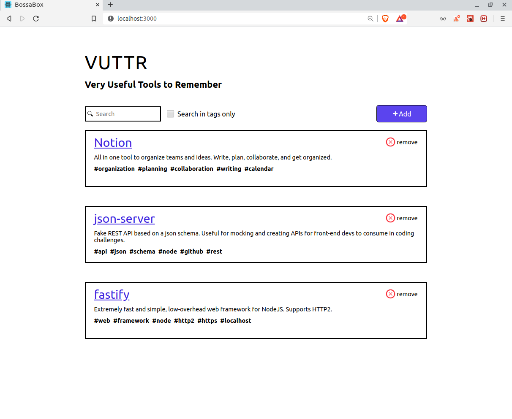
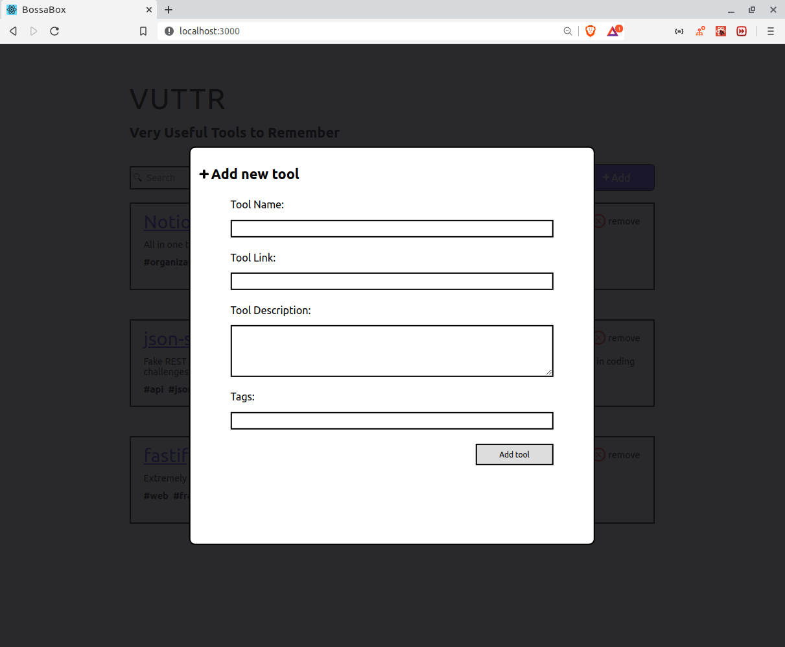
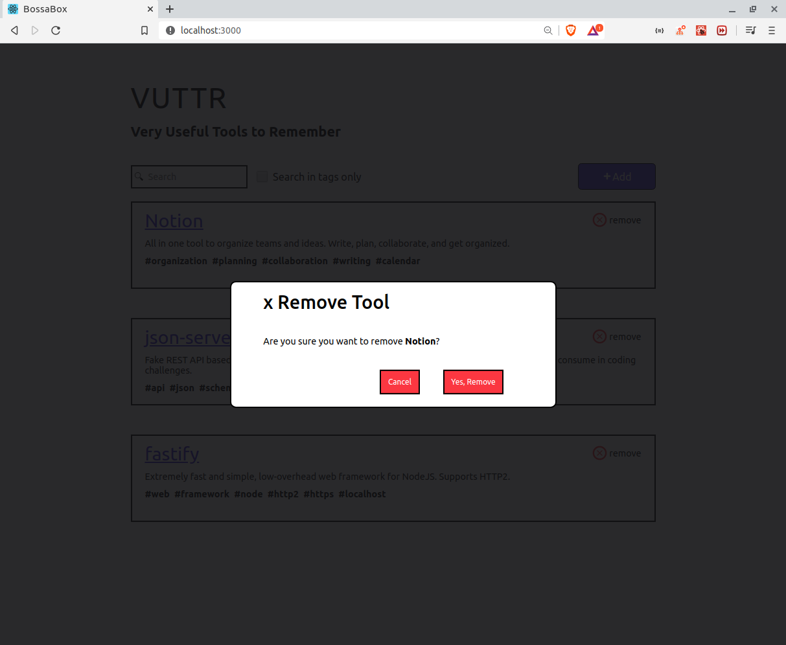

## Desafio BossaBox VUTTR (Very Useful Tools to Remember)


## Funções da aplicação

**1: O usuário pode ver a lista de todas as ferramentas cadastradas.**

<p align="center">

</p>

**2: O usuário pode adicionar uma nova ferramenta. Basta clicar no botão adicionar, que em seguida aparecera um modal, 
com os requesitos para a criaçao de uma ferramenta.**

<p align="center">

</p>

**3: O usuário pode remover uma ferramenta. Basta clicar no icone de X, logo em seguida aparecera um modal perguntando se
voce deseja apagar a ferramenta.**

<p align="center">

</p>

**4: O usuário pode buscar ferramentas dinamicamente (global ou utilizando apenas tags).**

## Como executar a aplicação
```
git clone https://github.com/MarcusMartins38/BossaBox_Vuttr.git
cd BossaBox_Vuttr
yarn
yarn json-server server.json -p 3333
yarn start

```
